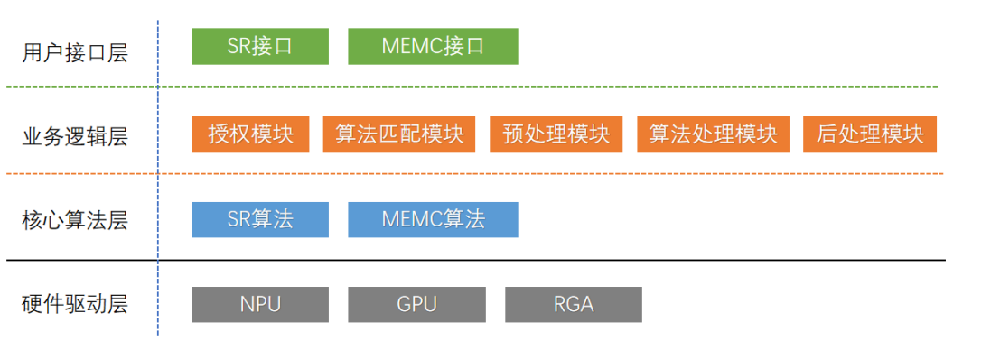
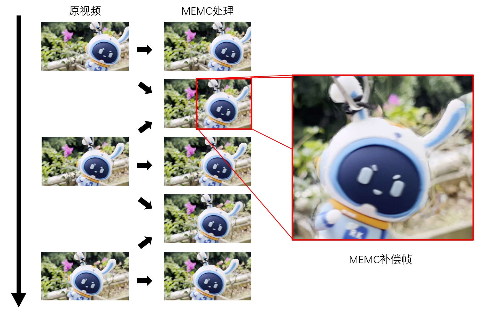

## MEMC简介

SVEP（Super Vision Enhancement Process，超级视觉增强处理），是一项利用深度学习实现的图像增强处理技术，目前实现算法主要有MEMC与SR两类：

- **MEMC（Motion Estimation and Motion Compensation，运动补偿）**，MEMC算法利用深度神经网络从前后两帧原始帧计算出中间的预测帧，提高视频帧率以获得较原始视频更流畅的感官体验。
- SR（Super Resolution，超级分辨率），SR算法利用深度神经网络补充图片纹理细节，将原始低分辨率输入重建为清晰高分辨输出，以提升视频清晰度获得更高主观感知。

MEMC软件架构如下图：



**用户接口层**：主要提供简洁的MEMC用户调用接口，**也是本文档介绍的重点**；

**业务逻辑层**：主要由授权模块、算法匹配模块组成、预处理模块，后处理模块组成：

1. 授权模块：主要用于算法软件授权，未经授权不允许调用相关核心算法；

2. 算法匹配模块：主要针对输入图像参数进行算法匹配；

3. 预处理模块：主要对输入图像进行图像预处理，使输入数据满足算法相关约束；

4. 算法处理模块：主要调用核心算法进行图像处理；

5. 后处理模块：主要对算法输出模块进行图像后处理，例如添加OSD，实现对比模式等；

**核心算法层**：提供MEMC算法实现；

**硬件驱动层**：底层驱动提供NPU/GPU/RGA 硬件支持；

## 支持平台

| 芯片平台 | Android |
| -------- | ------- |
| RK3588   | 支持    |

## 效果展示

MEMC算法利用深度神经网络从前后两帧原始帧计算出中间的预测帧，下图展示了预测帧的细节和原始视频补偿了预测帧后的显示效果：



## 文档说明

- Android 开发文档：[Rockchip_User_Guide_Android_SVEP_MEMC_CN.pdf](docs/Rockchip_User_Guide_Android_SVEP_MEMC_CN.pdf)
- 设备Vendor Storage分区说明文档：[Rockchip_Application_Notes_Storage_CN.pdf ](docs/Rockchip_Application_Notes_Storage_CN.pdf)

## 目录说明

```shell
.
├── CHANGELOG.md   ## 更新说明
├── docs           ## 文档目录
│   ├── Rockchip_Application_Notes_Storage_CN.pdf         ## VendorStorage 说明文档
│   └── Rockchip_User_Guide_Android_SVEP_MEMC_CN.pdf      ## MEMC Android 接口说明文档
├── lib             ## MEMC用户接口库文件目录
├── LICENSE         ## 授权证书
├── README.md       ## README
├── resources       ## 资源文件
└── tools           ## 工具目录，主要为授权码简易写码工具
```

## 更新说明

## 1.4.6

* 修复内部内存泄漏和稳定性问题
* 支持异步初始化
* 支持流畅度优化模式
