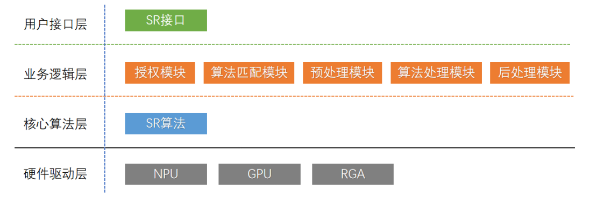

## SR简介

SVEP（Super Vision Enhancement Process，超级视觉增强处理），是一项利用深度学习实现的图像增强处理技术，目前实现算法主要有SR与MEMC两类：

- **SR（Super Resolution，超级分辨率）**，SR算法利用深度神经网络补充图片纹理细节，将原始低分辨率输入重建为清晰高分辨输出，以提升视频清晰度获得更高主观感知。
- MEMC（Motion Estimation and Motion Compensation，运动补偿），MEMC算法利用深度神经网络从前后两帧原始帧计算出中间的预测帧，提高视频帧率以获得较原始视频更流畅的感官体验。


SR 软件架构如下图：



**用户接口层**：主要提供简洁的SR用户调用接口，**也是本文档介绍的重点**；

**业务逻辑层**：主要由授权模块、算法匹配模块组成、预处理模块，后处理模块组成：

1. 授权模块：主要用于算法软件授权，未经授权不允许调用相关核心算法；

2. 算法匹配模块：主要针对输入图像参数进行算法匹配；

3. 预处理模块：主要对输入图像进行图像预处理，使输入数据满足算法相关约束；

4. 算法处理模块：主要调用核心算法进行图像处理；

5. 后处理模块：主要对算法输出模块进行图像后处理，例如添加OSD，实现对比模式等；

**核心算法层**：提供SR算法实现；

**硬件驱动层**：底层驱动提供NPU/GPU/RGA 硬件支持；


## 支持平台

| 芯片平台 | Linux | Android |
| -------- | ----- | ------- |
| RK3588   | 支持  | 支持    |
| RK3566   | 支持  | 支持    |
| RK3568   | 支持  | 支持    |


## 效果展示

效果展示如下图，第一行图片为SR处理后效果，第二行图片为原视频片源效果图：


## 信息记录

- Latest version : 2.1.1b2 (Release version)


## 文档说明

- 用户接口文档：[Rockchip_API_Reference_SVEP_SR_CN.pdf](./docs/Rockchip_API_Reference_SVEP_SR_CN.pdf)
- Android 开发文档：[Rockchip_Developer_Guide_Android_SVEP_SR_CN.pdf](docs/Rockchip_Developer_Guide_Android_SVEP_SR_CN.pdf)
- 搭建SR演示环境教程文档：[Rockchip_Tutorial_Android_SVEP_SR_CN.pdf](docs/Rockchip_Tutorial_Android_SVEP_SR_CN.pdf)


## 目录说明

```shell
.
├── CHANGELOG.md   ## 更新说明
├── docs           ## 文档目录                               
│   ├── Rockchip_API_Reference_SVEP_SR_CN.pdf             ## API说明文档
│   ├── Rockchip_Developer_Guide_Android_SVEP_SR_CN.pdf   ## Android 开发文档 
│   ├── Rockchip_Tutorial_Android_SVEP_SR_CN.pdf          ## 搭建SR演示环境教程文档
│   └── Rockchip_Application_Notes_Storage_CN.pdf         ## VendorStorage 说明文档
├── examples        ## SR用例目录
├── lib             ## SR用户接口库文件目录
├── LICENSE         ## 授权证书
├── README.md       ## README
├── resources       ## 资源文件
└── tools           ## 工具目录，主要为授权码简易写码工具
```


## 更新说明

## 2.1.1b2
- 解决Linux平台OSD模块概率出现Segment Fault问题
- 解决概率出现输出有OSD但没有SR效果问题
- 优化CPU调频策略
- 更新Android 11/12/13/14 平台显示系统补丁
- 增加Linux初始化Vulkan报错章节说明

## 2.1.0

- 支持RK3588使能SRAM，可减少40%以上的NPU端的DDR带宽数据量
- 支持RK3568/RK3566平台
- 优化SR调用接口
- 解决内存泄漏问题
- 解决若干稳定性问题
- 完善用户文档

更详细的更新说明请查看 [CHANGELOG](./CHANGELOG.md)
